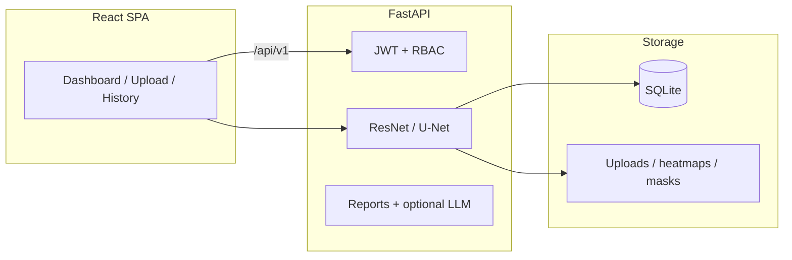

[README.md](https://github.com/user-attachments/files/27807643/README.md)
# AI Medical Diagnosis Assistant

**Chest X-ray & brain MRI analysis** with deep learning, explainability (Grad-CAM), segmentation (U-Net), clinical-style reports, JWT authentication, **FastAPI** backend, and **React + Tailwind** dashboard.

> **Disclaimer:** For **research and education** only. Not a regulated medical device. Do not use for patient care without clinical validation, IRB approval, and compliance with HIPAA / GDPR / local law.

---

## Features

| Area | Details |
|------|---------|
| **Chest X-ray** | Multi-label ResNet50 (pneumonia, COVID-19, effusion, fibrosis, cardiomegaly, atelectasis) |
| **Brain MRI** | 4-class ResNet18 (glioma, meningioma, pituitary, normal) |
| **Explainability** | Grad-CAM heatmaps |
| **Segmentation** | U-Net masks (saliency fallback if no checkpoint) |
| **Reports** | Rule-based findings / impression; optional OpenAI explanation |
| **Auth** | Register / login, JWT, roles `doctor` and `admin` |
| **UI** | Dashboard, upload & analyze, history, dark/light theme |

---

## Prerequisites

| Tool | Version |
|------|---------|
| **Python** | 3.11+ |
| **Node.js** | 20+ |
| **npm** | Comes with Node |
| **Docker** (optional) | Docker Desktop if you want `docker compose` |

---

## Quick start (Windows — one command)

From the project folder `medical-diagnosis-ai`:

```powershell
.\start.ps1
```

If scripts are blocked:

```powershell
Set-ExecutionPolicy -Scope CurrentUser RemoteSigned
.\start.ps1
```

Or double-click **`start.bat`**.

This will:

1. Create a Python virtualenv and install backend dependencies  
2. Run `npm install` for the frontend (first time)  
3. Open **two windows**: API on port **8000**, UI on port **5173**

Then open:

| URL | Purpose |
|-----|---------|
| http://127.0.0.1:5173 | Web app |
| http://127.0.0.1:8000/docs | Swagger API docs |
| http://127.0.0.1:8000/health | Health check |

**First use:** click **Register**, create an account (password ≥ 8 characters), then use **Analyze** to upload an image.

---

## Manual setup (two terminals)

### Terminal 1 — Backend

```powershell
cd backend
python -m venv .venv
.\.venv\Scripts\Activate.ps1
pip install -r requirements.txt
copy .env.example .env
uvicorn app.main:app --reload --host 127.0.0.1 --port 8000
```

### Terminal 2 — Frontend

```powershell
cd frontend
npm install
npm run dev
```

Open http://127.0.0.1:5173

The frontend calls the API at **`/api/v1`** (proxied to port 8000 in dev). Do not set `VITE_API_URL` unless the API is on another host.

### Optional admin user (`.env`)

```env
SECRET_KEY=your-long-random-secret
ADMIN_EMAIL=admin@hospital.local
ADMIN_PASSWORD=ChangeMeNow123!
```

Restart the backend after editing `.env`. The admin is created on first startup if the email does not exist.

---

## Docker (optional)

Requires [Docker Desktop](https://www.docker.com/products/docker-desktop/) installed and on your PATH.

```powershell
docker compose up --build
```

| URL | Service |
|-----|---------|
| http://localhost:8080 | Web UI |
| http://localhost:8000/docs | API |

---

## Using the app

1. **Register** or **Sign in**  
2. **Analyze** — upload a chest X-ray (`.png`, `.jpg`) or brain MRI image  
3. View **probabilities**, **Grad-CAM heatmap**, and **segmentation mask**  
4. **Generate report** for structured findings  
5. **Dashboard** / **History** for past studies  

---

## Train models (optional)

From `medical-diagnosis-ai` (with backend venv activated or system Python + deps installed):

```powershell
python ml_models/train_chest_multilabel.py
python ml_models/train_brain_mri.py
python ml_models/train_unet_segmentation.py
```

Checkpoints are saved to `ml_models/checkpoints/`:

- `chest_resnet50.pt`
- `brain_resnet18.pt`
- `unet_segmentation.pt`

Restart the backend to load new weights.

**TensorBoard:**

```powershell
tensorboard --logdir ml_models/runs
```

### NIH ChestX-ray14 CSV helper

```powershell
python ml_models/preprocess/nih_csv.py `
  --nih-csv "PATH\Data_Entry_2017.csv" `
  --image-root "PATH\images" `
  --out datasets/chest_xray_nih/train.csv
```

Then train with `--data-dir datasets/chest_xray_nih`.

### Public datasets (you download; check each license)

- [NIH ChestX-ray14](https://nihcc.app.box.com/v/ChestXray-NIHCC)
- Brain Tumor MRI (Kaggle)
- COVID-19 Radiography Database (Kaggle)
- Open-i (images + reports)

Place files under `datasets/` (large files are gitignored).

---

## API reference

Base path: **`/api/v1`** — full interactive docs at http://127.0.0.1:8000/docs

| Method | Path | Description |
|--------|------|-------------|
| POST | `/auth/register` | Create account |
| POST | `/auth/login` | Get JWT |
| GET | `/auth/me` | Current user |
| POST | `/upload` | Upload image (`modality`: `chest_xray` or `brain_mri`) |
| POST | `/predict` | Classify + heatmap + mask |
| GET | `/heatmap/{prediction_id}` | Grad-CAM PNG |
| POST | `/segmentation` | Mask only |
| GET | `/segmentation/{prediction_id}/image` | Mask PNG |
| POST | `/generate-report` | Clinical-style report |
| GET | `/history` | User prediction history |
| GET | `/stats` | Dashboard stats |
| POST | `/assistant/chat` | AI assistant |
| GET | `/assistant/model-info` | Model metadata |

---

## Troubleshooting

### Registration failed

| Message | Fix |
|---------|-----|
| **Cannot reach the API** | Start the backend (`uvicorn` or `.\start.ps1`). Check http://127.0.0.1:8000/health |
| **Email already registered** | Use **Sign in** with the same email, or delete `backend\data\medical_ai.db` and restart backend |
| **Validation error** | Password must be **≥ 8 characters**; use a valid email |

### `docker` is not recognized

Docker is not installed. Use **`.\start.ps1`** instead of `docker compose`.

### `start.ps1` parse error

Pull the latest `start.ps1` from the repo, or use the **manual setup** above.

### Slow first prediction

First run downloads ImageNet weights for ResNet; later requests are faster.

---

## Project structure

```
medical-diagnosis-ai/
├── backend/              # FastAPI app
│   ├── app/
│   │   ├── routes/       # auth, medical, advanced
│   │   ├── services/     # ML, auth, reports
│   │   └── ml/           # model architectures
│   ├── data/             # SQLite DB, uploads (created at runtime)
│   └── requirements.txt
├── frontend/             # React + Vite + Tailwind
├── ml_models/            # Training scripts & checkpoints
├── docker/               # Dockerfiles + nginx.conf
├── datasets/             # Your local data (not in git)
├── start.ps1             # One-shot Windows launcher
├── start.bat
├── docker-compose.yml
└── README.md
```

---

## Architecture



---

## Tech stack

- **Frontend:** React, TypeScript, Vite, Tailwind CSS, Axios, Chart.js  
- **Backend:** FastAPI, Uvicorn, SQLAlchemy, SQLite (async)  
- **ML:** PyTorch, torchvision (ResNet, U-Net), Grad-CAM  
- **Auth:** JWT, bcrypt, passlib  

Training is **PyTorch-first**. TensorFlow/Keras can be added separately if needed.

---

## Security (production)

- Set a strong `SECRET_KEY` in `backend/.env`  
- Never commit `.env` or patient data  
- Restrict public **admin** registration in production  
- For PHI: encryption, audit logs, and cloud BAAs  

---

## Performance note

Published targets (e.g. 90%+ accuracy, high Dice, BLEU > 0.41) require **your own** labeled data and training. Demo checkpoints may be trained on **synthetic** sample data only — outputs are **not** clinical diagnoses.

---

## License

MIT for this codebase — verify licenses for any **datasets** and **pretrained weights** you use.
